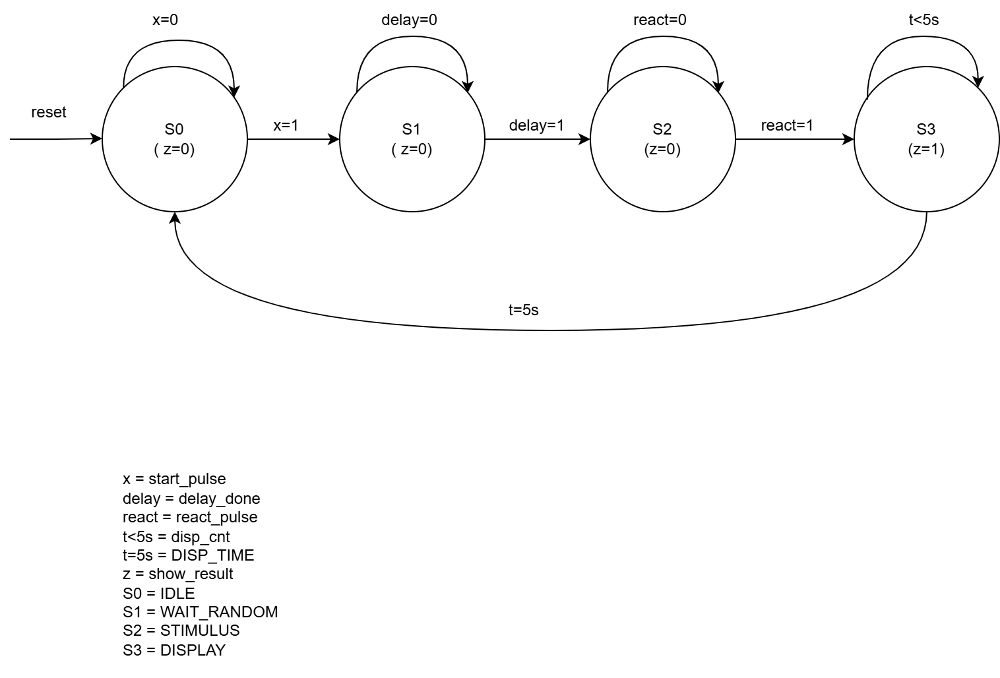
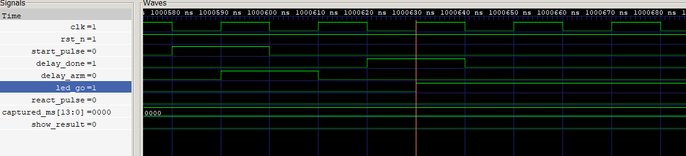
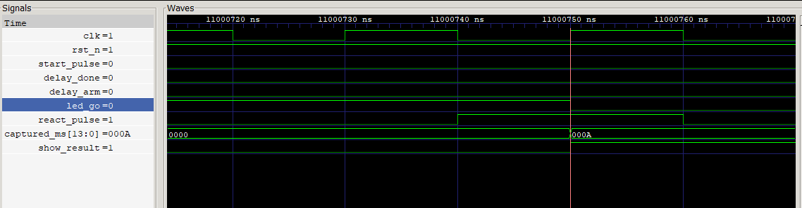

# FPGA Reaction Time Game

<p align="center">
  A simple reaction speed test game implemented on an FPGA using Verilog HDL.
</p>

---

##  About The Project

**FPGA Reaction Time Game** is a digital design project developed using **Verilog HDL** and implemented on an **Intel/Altera FPGA board**.

The game measures the player's reaction speed by generating a random delay, activating an LED signal, and measuring the time taken by the player to press a button. The final reaction time is displayed on a 4-digit seven-segment display.

This project demonstrates the use of FPGA hardware design concepts such as **finite state machines, counters, timing control, and display drivers**.

---

##  How It Works

```
RESET
  │
  ▼
Waiting State
  │
  ▼
Random Delay Generated
  │
  ▼
LED Turns ON 🚦
  │
  ▼
Player Presses Button
  │
  ▼
Reaction Time Calculated
  │
  ▼
Result Displayed On 7-Segment Display
```

---

## Features

_ Randomized waiting time

_ LED start indicator

_ Push-button reaction detection

_ High precision reaction timer

_ 4-digit seven-segment display output

_ Fully written in Verilog HDL

_ Real-time FPGA implementation

---

##  Built With

### Hardware

* Intel/Altera FPGA Development Board
* FPGA Clock
* LEDs
* Push Buttons
* Seven-Segment Displays

### Software

* Verilog HDL
* Intel Quartus Prime
* Icarus Verilog (simulation)
* GTKWave (waveform viewing)
* ModelSim / Questa (optional alternative simulator)

---

## Simulation

A self-checking testbench with 7 tests covering reset, state transitions, and reaction-time measurements of 0ms, 1ms, and 10ms.

**Icarus Verilog:**
```bash
iverilog -o simulation src/FPGA_reaction_timer_game.v tb/tb_FPGA_reaction_timer_game.v
vvp simulation
```
Expected output : 

```bash
Test 1 passed
Test 2 passed
Test 3 passed: captured_ms=0
Test 4 passed
Test 5 passed: captured_ms=1
Test 6 passed: captured_ms=10
Test 7 passed: show_result=1

Simulation completed
Passed: 7
Failed: 0
```

---


**Images — the three PNGs from `doc/`:**

## FSM Design



## Waveforms

Measurement start : `start_pulse` triggers the FSM and activates the LED :



Measured result : After a 10ms reaction time , `captured_ms`= 0xA and `show_result` is high:




---

## Getting Started

### Requirements

* Intel Quartus Prime
* Compatible FPGA board
* USB-Blaster programmer

### Installation

Clone the repository:

```bash
git clone https://github.com/SHADYOO-0/FPGA-Reaction-Time-Game.git
```

Open the project in **Quartus Prime**:

1. Compile the Verilog files
2. Assign FPGA pins
3. Generate the programming file
4. Upload it to the FPGA board

---

## Project Structure

| Path | Contents |
|---|---|
| `rtl/` | RTL design |
| `tb/`  | Self-checking testbench |
| `doc/` | FSM diagram and waveforms |

---

##  Concepts Implemented

* Finite State Machine (FSM)
* Clock counters
* Timing measurement
* Pseudo-random number generation
* Digital logic design
* Seven-segment display multiplexing
* Hardware input/output control

---

##  Authors

**Nidhal Antar**

Embedded Systems & IoT Engineering Student

University of Carthage – Faculty of Sciences of Bizerte

**Elaa Mchirgui**  
Embedded Systems & IoT Engineering Student

University of Carthage – Faculty of Sciences of Bizerte
